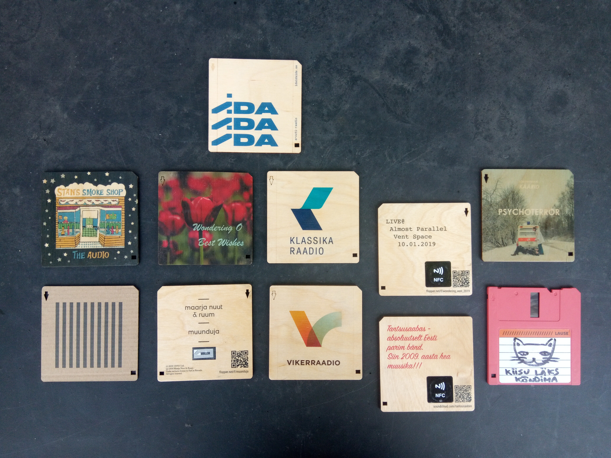
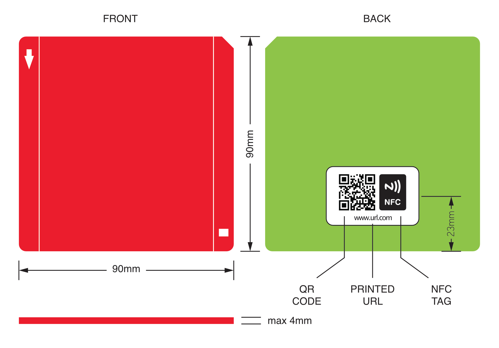

# Linki Standard - NFC based physical media format

Linki is an open standard for physical medium of digital content.

Linki is a rectangular object of any material linking to online content through a NFC tag. Everybody are free to create, release, sell their own linkies for music, video, streams, games, apps etc. Linki is built on the technologies of the web - it uses URLs and NFC to combine the physical and virtual worlds.

Linkies are usable with smartphones with NFC support or with [open hardware linki players](https://github.com/timotoots/linki_players).

Linki is an open source design project initiated by artist [Timo Toots](https://www.timo.ee) and his [Studio Masinism](https://www.masinism.ee). Collaborators welcome to join!

[Website of Linki project](https://www.linki.cc)

# Physical properties

Linki is a physical object from any material like wood, cardboard, metal etc* with following dimensions:

* Size 90x90mm (3.54" x 3.54")
* Maximum thickness 4mm (0.157")

* Recyclable materials are prefferred

## URL
URL can be stored in three ways:        
1. NFC tag (obligatory)        
2. QR-code (optional)        
3. Printed as text (optional)  

## Design
The design of the linki is open for creativity. There are four design elements that could be used:
1. downward arrow
2. rectangular hole
3. two vertical lines
4. top right corner is cut

# NFC
The URL should be written on the NFC chip as a message in [NFC Data Exchange Format (NDEF)](https://learn.adafruit.com/adafruit-pn532-rfid-nfc/ndef).

The NFC tag should be positioned so it’s vertical center is 23mm from bottom edge and horizontally it’s centered.

# License and permissions
The standard and it's materials are released under [CC BY-SA](https://creativecommons.org/licenses/by-sa/4.0/) license.

Everybody are free to create linkies for commercial or non-commercial purposes, even without referring to the standard.
